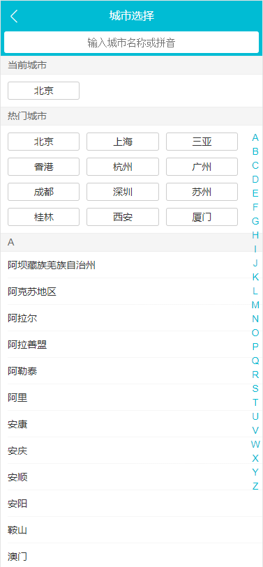

# Vue仿制移动端去哪儿网
一个基于`Vue`的仿制[移动端去哪儿网](http://piao.qunar.com/touch/)的练习项目

## 项目截图
#### 首页

#### 城市搜索页

#### 景点详情页


## 技术栈
* `Vue`： 项目开发
* `Vue-router`: 多页面之间的路由
* `Vuex`：各组件之间的数据共享
* `Vue-cli`：项目构建
* `Axios`：Ajax数据的获取
* `Stylus`：编写前端样式
* 插件：用`swiper`实现轮播效果 

## 数据来源
该项目所有的数据（景区名，价格，图片，评论等）都是用[GoWhere-Crawler](https://github.com/Jacleklm/GoWhere-Crawler)爬虫工具爬从[移动端去哪儿网](http://piao.qunar.com/touch/)取生成的`JSON`文件，放在`/static/mock`文件夹中


## 实现的功能
#### 首页
- [x] 多区域轮播
- [x] 多区域列表循环展示
#### 城市搜索页
- [x] 选择城市
- [x] 城市搜索
- [x] 右侧字母与左侧城市块的动画联动效果
#### 景点详情页
- [x] 公共画廊组件（点开景点图片即可看到）
- [x] 渐隐渐现的herder组件
- [ ] 用户评论组件（功能未完全完善）

## 使用方法

``` bash
# 克隆到本地
git clone git@github.com:Jacleklm/GoWhere.git

# 定位到该文件夹
cd GoWhere

# 安装依赖
npm install

# 运行。会打开本地的8080端口，访问http://localhost:8080即可查看。
npm run dev

# 生成打包代码
npm run build
```


